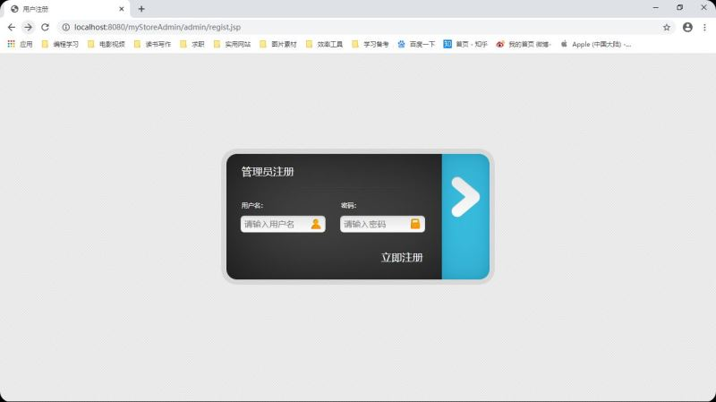
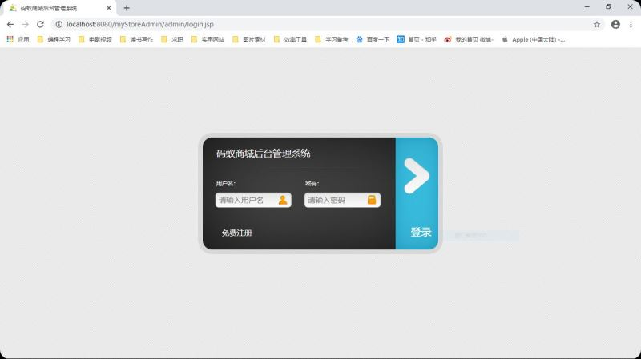
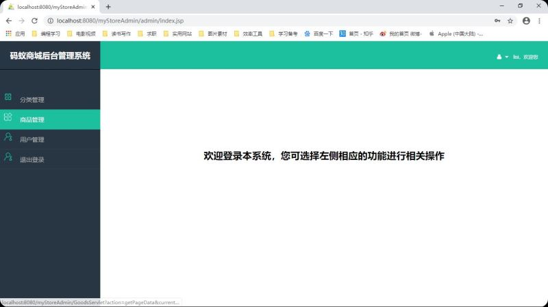
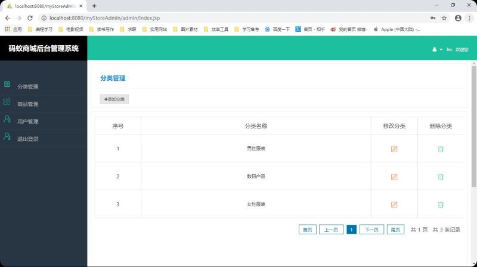
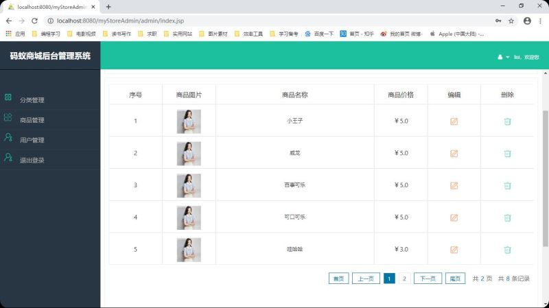
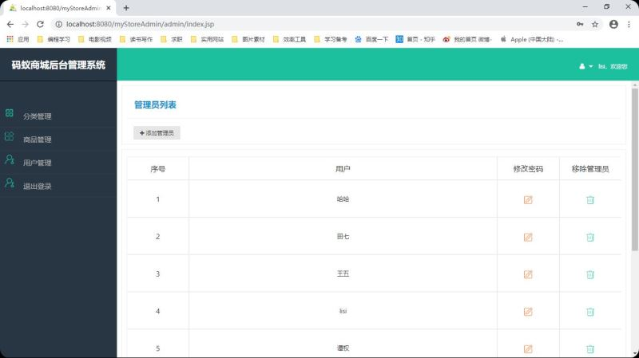

## myStoreAdmin

#### 我的第一个个人项目，网上购物商城后台管理系统

##### 1.项目描述

- 目的：个人为巩固所学专业知识，练习编程技能而做的一个比较简单的基于B/S架构的网上购物商城后台管理系统，也是毕业设计作品.
- 进展：本项目是后台管理系统的开发，实际用途是方便后台管理人员对前台商城商品信息、用户信息进行管理（至于相对应的前台Web商城项目，当时并没有专注于它的开发，等有时间了，看情况决定是否做吧）.
- 开发时间：2018.11-2019.2
- 该项目教程视频链接：[网易云课堂-撩课学院](https://study.163.com/course/courseMain.htm?courseId=1005981003)
##### 2.环境准备

    JDK1.8
    Tomcat8.0
    MySQL5.7
    eclipse
    navicat

注意：

- Tomcat的运行依赖于JDK（指配置的java_home环境变量），因此彼此版本要兼容才能成功将其跑起来.
- eclipse开发的项目无缝兼容IDEA.

##### 3.主要功能

注册，登录，对商品信息、商品分类信息、用户信息的添加、删除、修改、以及分页显示（即增删改查），图片上传、退出登录.

##### 4.采用技术

- 后端：

        1.JavaBean
        2.Servlet
        3.Jsp
        4.JDBC
        
- 前端：
        
        1.HTML、CSS
        2.JavaScript
        3.JQuery
        
    
采用了JavaBean+Servlet+JSP三层架构模式，用到了JDBC技术，前端页面采用HTML+CSS技术来制作，用到了JS做表单校验，用到了JQuery框架增强JS的功能.

##### 5.功能演示页面

- 注册：

- 登录：

- 主页:

- 分类管理:

- 商品管理：

-管理员列表：

注：由于该项目所用技术比较传统，有些过时，后期会抽时间将项目采用SSM框架进行项目重构.
                                      
